# Aledobe

Editor de design no navegador, gratuito, inspirado no Figma. Tem frames, auto layout, caneta e lápis, texto com tipografia de verdade, efeitos, páginas, exportação e um modo dev que gera CSS e Tailwind a partir de qualquer camada. Cada pessoa entra com a própria conta (Google, GitHub ou LinkedIn) e tem um workspace separado com projetos e arquivos.

Em produção: **https://aledobe.vercel.app**

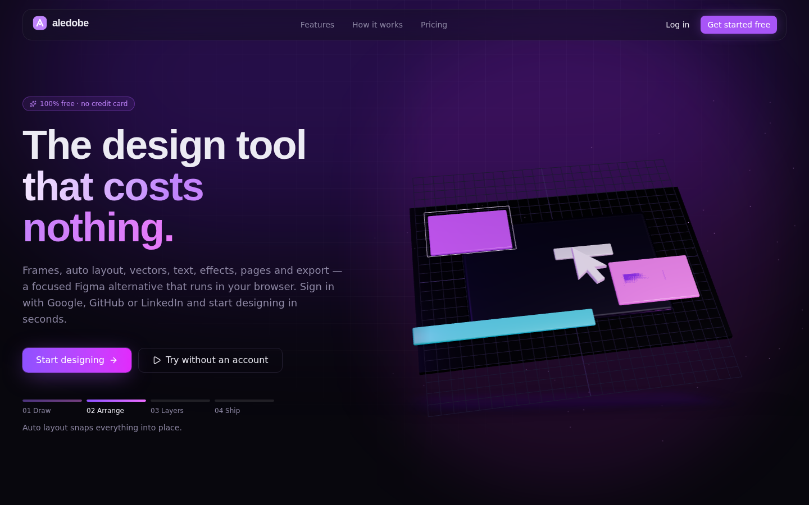

---

## Sumário

- [Como o projeto está organizado](#como-o-projeto-está-organizado)
- [Tour pelas telas](#tour-pelas-telas)
- [O fluxo completo, do clique ao banco](#o-fluxo-completo-do-clique-ao-banco)
- [Frontend](#frontend)
- [Backend](#backend)
- [Segurança](#segurança)
- [Rodando localmente](#rodando-localmente)
- [Testes](#testes)
- [CI/CD e deploy](#cicd-e-deploy)
- [Contribuindo](#contribuindo)

---

## Como o projeto está organizado

É um monorepo com duas pastas principais:

```
frontend/                 React 19 + Vite + Tailwind v4 (npm workspaces)
  apps/shell/             app "host": landing em 3D, login, dashboard, billing
  apps/editor/            o editor em si, publicado como remote de Module Federation
  packages/ui/            componentes compartilhados (base shadcn/ui) e o tema neon
  e2e/                    testes Playwright contra a stack inteira

backend/                  NestJS 12 + Prisma + PostgreSQL
  src/modules/identity/   usuários, OAuth, sessões
  src/modules/workspace/  projetos, arquivos, limites de plano
  src/modules/billing/    Stripe (checkout, portal, webhook)
  prisma/                 schema e migrations
  api/                    entrada da função serverless (Vercel)

docker-compose.yml        Postgres + API + frontend (nginx), igual à produção
.github/workflows/        CI, CD, CodeQL e smoke test pós-deploy
```

O editor é um microfrontend de verdade: o `shell` carrega o `editor` sob demanda via Module Federation. Isso deixa a landing e o dashboard leves (o Konva e o resto do editor só baixam quando alguém abre um arquivo) e permite versionar e publicar o editor separado se um dia fizer sentido.

---

## Tour pelas telas

### Landing

A home ocupa a largura toda da tela. À direita roda uma cena em three.js (via `@react-three/fiber`) que mostra o ciclo do produto em quatro passos: desenhar, organizar com auto layout, explodir as camadas e exportar. A barra de progresso embaixo dos botões acompanha a animação, e dá pra clicar num passo pra pular pra ele.

A câmera da cena se ajusta à proporção do container, então ela não corta nem em monitor ultrawide nem em celular. No mobile a cena vai pra baixo do texto.

| Desktop | Mobile |
| --- | --- |
|  | 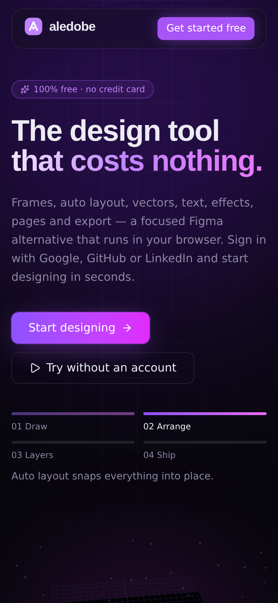 |

Mais abaixo ficam as funcionalidades, o "como funciona" e os planos:

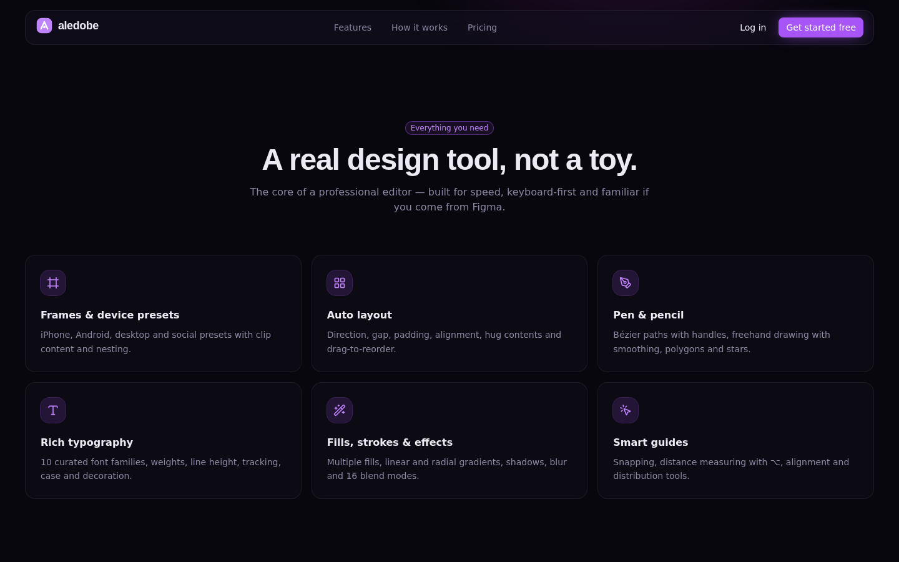

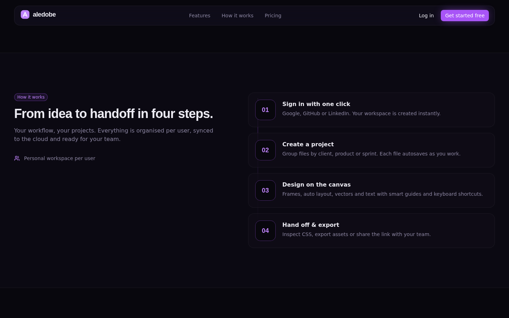

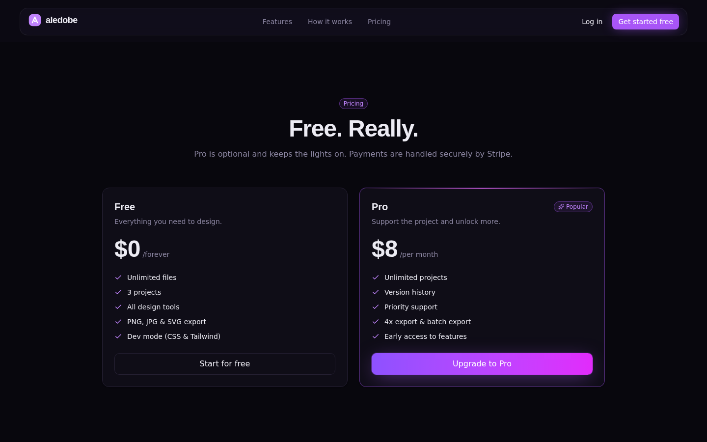

### Login

Só existe login por OAuth. A tela pergunta pro backend (`GET /api/auth/providers`) quais provedores estão configurados e habilita só esses. Os outros aparecem como "Em breve". Não tem formulário de e-mail e senha nem atalho de desenvolvimento: se a API estiver fora do ar, a tela avisa e não deixa ninguém entrar.

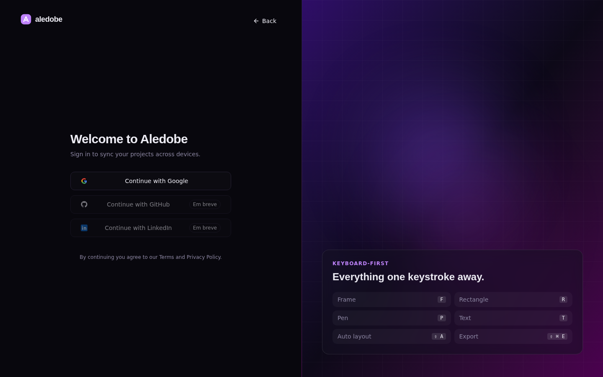

### Dashboard

Depois do login a pessoa cai nos recentes. Na lateral ficam os projetos (com contador de arquivos), a busca, o card de upgrade e o menu da conta. O plano gratuito permite 3 projetos, e essa regra fica no domínio do backend (`PlanPolicy`), não na tela.

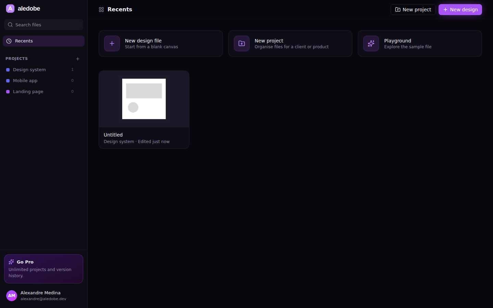

Dentro de um projeto aparecem os arquivos com miniatura. A miniatura é gerada pelo próprio editor a cada salvamento.

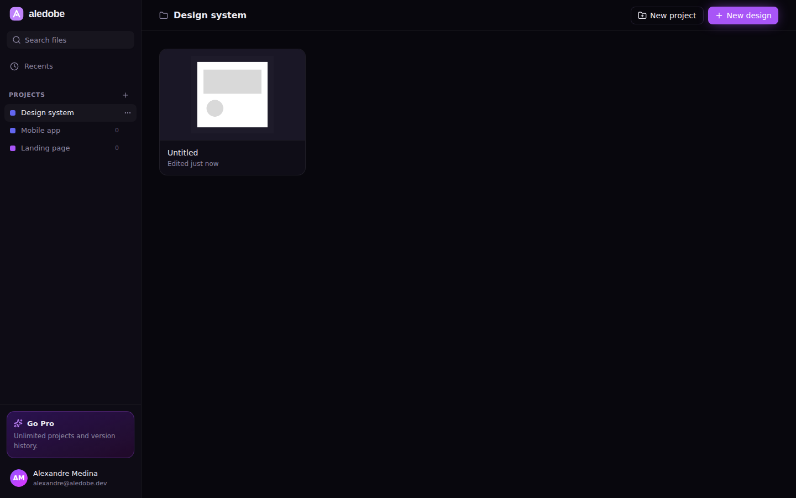

### Editor

O editor segue o layout que quem vem do Figma já conhece: páginas e camadas à esquerda, canvas no meio, propriedades à direita e a barra de ferramentas flutuando embaixo. O salvamento é automático, e o status aparece embaixo do nome do arquivo ("Unsaved changes", depois "Saved").

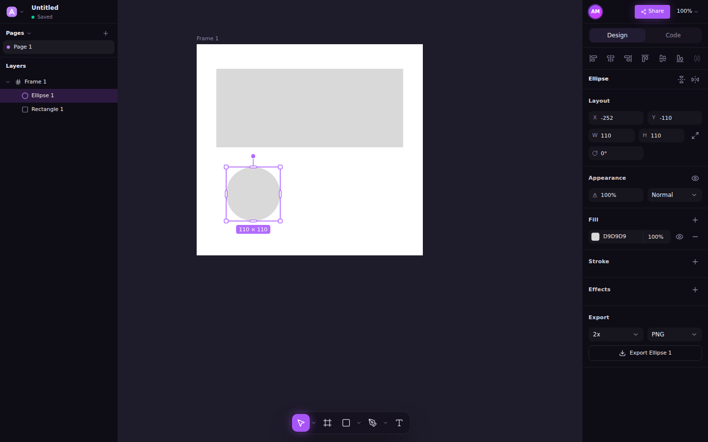

O playground (`/playground`) abre um arquivo de exemplo e não precisa de conta. É o jeito mais rápido de testar a ferramenta:


Selecionando um frame, o painel direito mostra layout, clip content, auto layout, aparência, preenchimentos (sólido, gradiente linear e radial), stroke, efeitos e exportação:

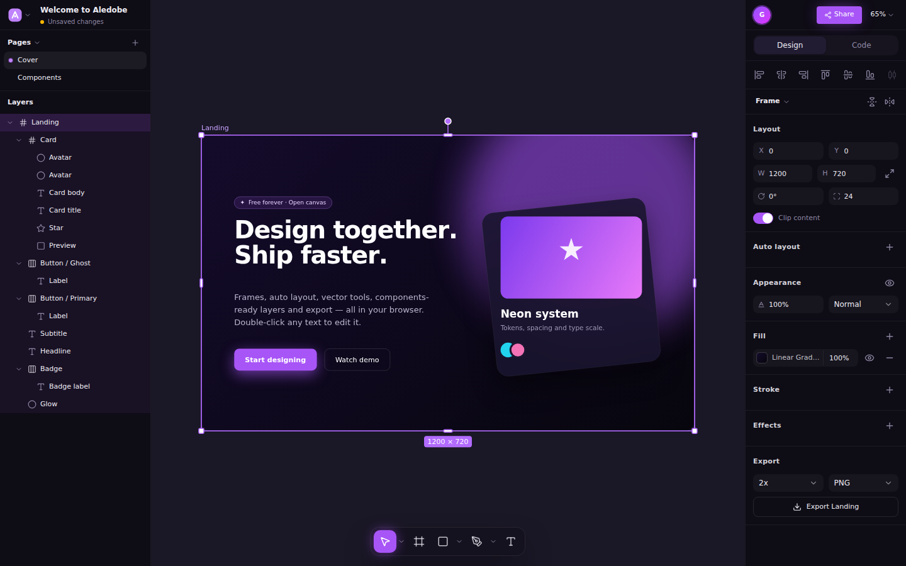

A aba **Code** é o modo dev: gera o CSS e as classes Tailwind da camada selecionada, prontos pra copiar.

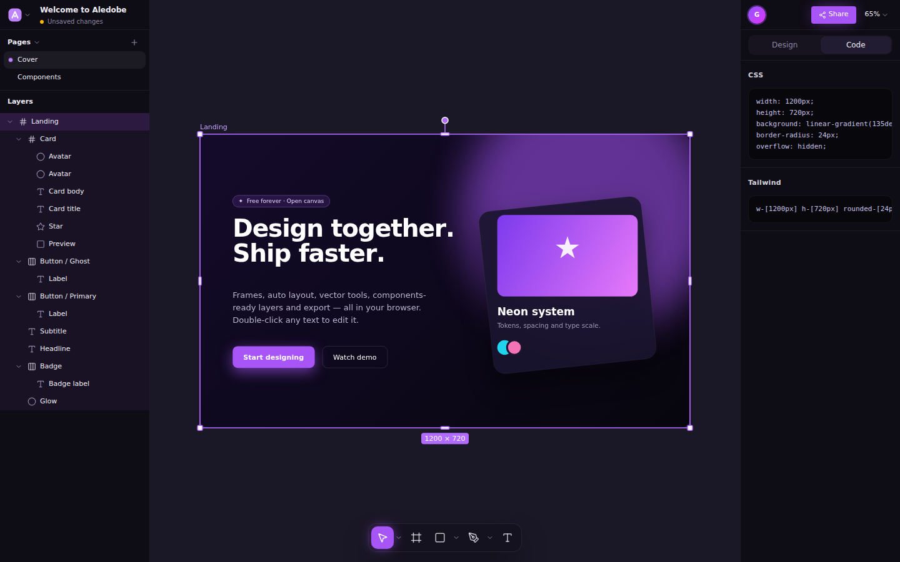

E o `?` abre a lista de atalhos. Quase tudo tem atalho, e eles seguem os do Figma (no Windows e no Linux, Ctrl no lugar de ⌘).

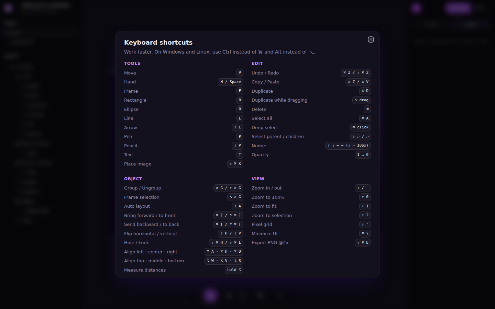

---

## O fluxo completo, do clique ao banco

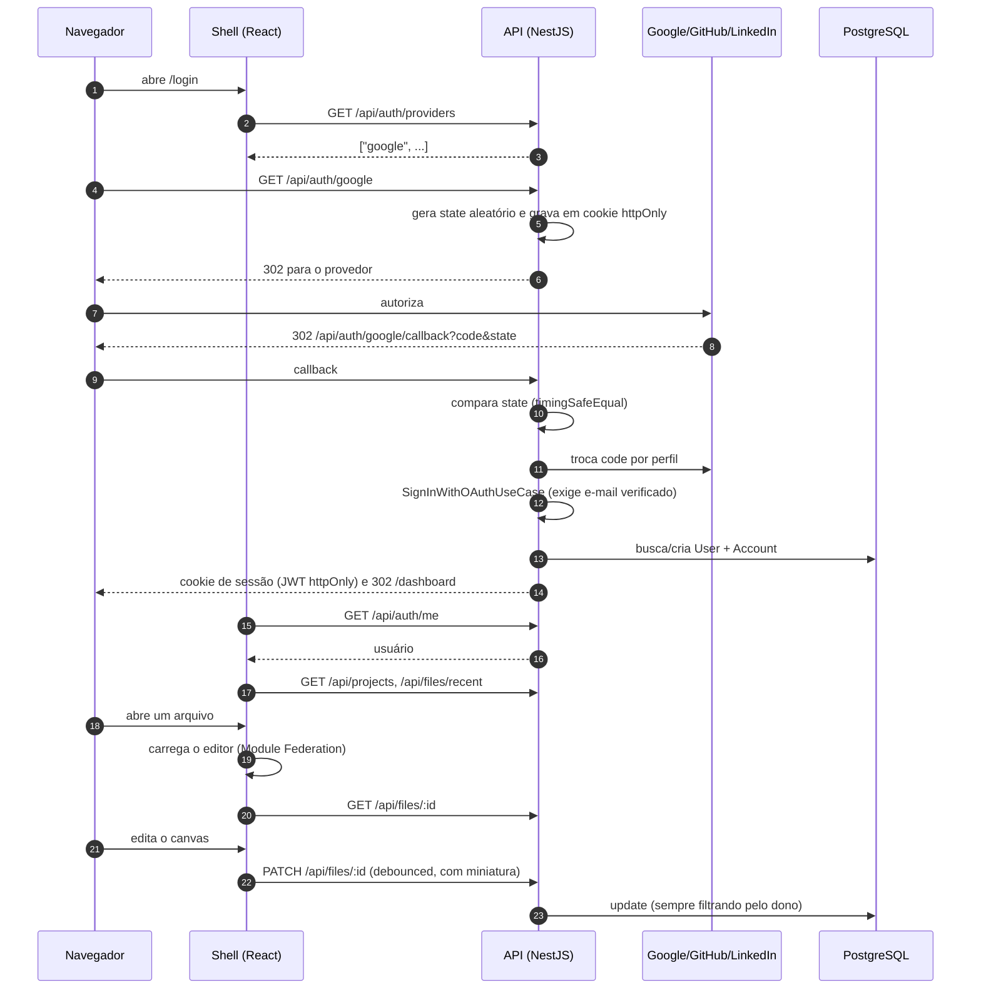

Alguns detalhes que valem saber:

- **Contas.** Se alguém entra com Google e depois com GitHub usando o mesmo e-mail, as duas contas são ligadas ao mesmo usuário, mas só se o provedor garantir que o e-mail é verificado. Sem essa verificação, alguém poderia criar uma conta no GitHub com o seu e-mail e entrar no seu workspace.
- **Sessão.** É um JWT HS256 com `issuer`, `audience` e expiração de 7 dias, guardado em cookie `httpOnly` e `SameSite=Lax` (em produção também com `Secure` e prefixo `__Host-`). O token carrega o `sessionVersion` do usuário; o logout incrementa esse número, o que derruba todas as sessões abertas em qualquer dispositivo.
- **Autosave.** O editor marca "Unsaved changes" na hora, espera a pessoa parar de mexer e envia o documento inteiro com a miniatura. Se a aba fechar no meio, o `beforeunload` faz um flush.

---

## Frontend

**Stack:** React 19, Vite 8, Tailwind v4, radix-ui/shadcn, lucide-react, motion, react-router, Zustand + Immer, Konva/react-konva, three.js, Sentry.

### `apps/shell`

- `lib/api.ts`: cliente HTTP da API. Toda chamada vai com `credentials: "include"`, e o cookie de sessão nunca fica acessível pelo JavaScript.
- `lib/session.ts`: store da sessão. Na inicialização checa se a API está de pé (`/health`) e busca o usuário em `/auth/me`. Rotas protegidas mandam pro `/login` quando não há sessão.
- `components/landing/*`: landing, com a cena 3D em `HeroScene.tsx`. O helper `.wide` do CSS define a largura máxima (1920px) e o padding responsivo.
- `pages/*`: Login, Dashboard, FilePage (hospeda o editor) e Playground.

### `apps/editor`

A regra aqui é separar o **núcleo** da **interface**:

- `src/core/` não importa React. Tem o modelo do documento (páginas, árvore de nós), geometria, auto layout, texto, histórico (undo/redo com transações `begin`/`preview`/`end`), atalhos, exportação e geração de CSS/Tailwind. Dá pra testar tudo com Vitest em ambiente Node.
- `src/components/` é a interface: canvas em Konva, painéis, toolbar e diálogos.
- A exportação SVG é renderizada a partir do mesmo documento (`render.tsx`); PNG e JPG saem da rasterização desse SVG.

Uma observação sobre texto: a largura dos textos em auto-width é medida em `core/text.ts` exatamente como o Konva mede na hora de desenhar (kerning desligado quando há letter spacing e espaçamento somado por glifo). Se essas duas contas divergirem, o Konva corta o último caractere. Tem teste cobrindo isso.

### `packages/ui`

Componentes base (Button, Dialog, Tabs, DropdownMenu, Tooltip…) e o tema dark com roxo neon, em `theme.css`, que vale para o shell e para o editor.

---

## Backend

**Stack:** NestJS 12, Prisma 6 (engine `client` com `@prisma/adapter-pg`, sem binário nativo), PostgreSQL, Passport, `@nestjs/jwt`, `@nestjs/throttler`, helmet, class-validator, Stripe, Sentry, Vitest.

### Arquitetura (DDD)

Cada contexto em `src/modules/<contexto>` tem quatro camadas:

| Camada | O que tem | Depende de |
| --- | --- | --- |
| `domain` | entidades (`User`, `Project`, `DesignFile`), regras como a `PlanPolicy` e as portas dos repositórios (classes abstratas) | nada |
| `application` | um caso de uso por classe (`CreateProjectUseCase`, `SignInWithOAuthUseCase`…) e portas de saída (`SessionTokenService`, `PaymentGateway`) | domain |
| `infrastructure` | repositórios Prisma, JWT, estratégias do Passport, gateway do Stripe | application e domain |
| `presentation` | controllers, DTOs, guards | application |

As portas são classes abstratas usadas como token de injeção do Nest. Isso deixa o domínio sem nenhum import de framework e permite trocar a implementação nos testes (veja `test/in-memory.ts`). Quando um contexto precisa de algo de outro (por exemplo, o workspace precisa saber o plano do usuário), a conversa passa por uma porta, nunca por import direto do repositório alheio.

### Rotas

Tudo fica sob `/api`.

| Método | Rota | O que faz |
| --- | --- | --- |
| GET | `/health` | checa a API e o banco |
| GET | `/auth/providers` | lista os provedores OAuth configurados |
| GET | `/auth/:provider` | inicia o OAuth (google, github, linkedin) |
| GET | `/auth/:provider/callback` | retorno do provedor, cria a sessão |
| GET | `/auth/me` | usuário da sessão |
| POST | `/auth/logout` | encerra todas as sessões do usuário |
| GET/POST | `/projects` | lista e cria projetos |
| PATCH/DELETE | `/projects/:id` | renomeia, muda cor, apaga |
| GET/POST | `/projects/:id/files` | arquivos do projeto |
| GET | `/files`, `/files/recent` | todos os arquivos / recentes |
| GET/PATCH/DELETE | `/files/:id` | abre, salva, apaga |
| POST | `/files/:id/duplicate` | duplica |
| POST | `/billing/checkout`, `/billing/portal` | Stripe Checkout e portal do cliente |
| POST | `/billing/webhook` | webhook do Stripe (assinatura verificada com o raw body) |

### Banco

O schema está em `backend/prisma/schema.prisma`: `User`, `Account` (uma linha por provedor ligado), `Project` e `File` (o documento do editor fica em JSON). O cliente Prisma é gerado em `prisma/generated/client`, fora do `node_modules`, porque o bundler do Vercel ignora a pasta `.prisma` e a função ficava sem o compilador WASM.

Em produção o banco é um Postgres do Supabase. A API conecta com um role próprio, sem superusuário e sem `bypassrls`, dono só do schema `app`, com row level security ligado em todas as tabelas e `statement_timeout` de 15s.

### Serverless

No Vercel a API roda como uma função (`backend/api/index.js`). Como os pacotes do NestJS 12 são só ESM e o runtime do Vercel não permite `require()` de ESM, o build gera um bundle CommonJS com esbuild (`scripts/bundle-serverless.mjs`) a partir de `src/serverless.ts`. Pra rodar do jeito que o Vercel roda, localmente:

```bash
cd backend
npm run build && node scripts/bundle-serverless.mjs
NODE_OPTIONS=--no-experimental-require-module node -e 'require("./api/index.js")'
```

---

## Segurança

Isso foi tratado como requisito desde o começo, não como etapa final:

- **SQL injection:** todo acesso passa pelo Prisma com parâmetros. `$queryRawUnsafe` e `$executeRawUnsafe` são proibidos, e o CI falha se alguém usar.
- **Isolamento entre usuários:** todo repositório filtra pelo `ownerId`. Um recurso de outra pessoa responde 404, não 403, pra não confirmar que ele existe.
- **Entrada:** DTOs com `whitelist` e `forbidNonWhitelisted`; campo desconhecido é rejeitado.
- **CSRF:** cookies `SameSite=Lax` mais um `OriginGuard` que recusa escrita vinda de outra origem (`Origin` e `Sec-Fetch-Site`).
- **OAuth:** `state` aleatório em cookie httpOnly comparado em tempo constante; e-mail verificado é obrigatório pra ligar contas.
- **Rate limit** global e mais apertado nas rotas de auth.
- **Headers:** helmet na API; CSP, HSTS, `X-Frame-Options: DENY` e afins no nginx e no Vercel.
- **Configuração:** a API não sobe em produção com `JWT_SECRET` fraco ou de exemplo, `FRONTEND_URL` sem https, ou Stripe sem segredo de webhook (`assertSecureConfig`).
- **Erros:** o Sentry remove cookies, headers de autorização e corpo das requisições antes de enviar qualquer evento.

Mais detalhes e como reportar uma vulnerabilidade: [SECURITY.md](SECURITY.md).

---

## Rodando localmente

Precisa de Node 22+ e Docker.

### Tudo com Docker

```bash
cp .env.example .env
echo "POSTGRES_PASSWORD=$(openssl rand -hex 24)" >> .env
echo "JWT_SECRET=$(openssl rand -hex 48)" >> .env
docker compose up --build
```

Abre em http://localhost:8080. Não tem credencial fixa no repositório: o compose se recusa a subir sem o `.env`.

Pra conseguir logar, configure pelo menos um provedor OAuth em `backend/.env` (veja abaixo). A URL de callback local é `http://localhost:8080/api/auth/<provider>/callback`.

### Desenvolvimento (com hot reload)

```bash
docker compose up -d postgres

cd backend
cp .env.example .env        # preencha DATABASE_URL, JWT_SECRET e um provedor OAuth
npm install
npx prisma migrate dev
npm run start:dev           # http://localhost:3000/api

cd ../frontend
npm install
npm run dev                 # shell em :5173, editor em :5174
```

### Variáveis de ambiente do backend

| Variável | Pra que serve |
| --- | --- |
| `DATABASE_URL` / `DIRECT_URL` | conexão com o Postgres (a `DIRECT_URL` é usada pelas migrations) |
| `JWT_SECRET` | assinatura da sessão, com no mínimo 32 caracteres (`openssl rand -hex 48`) |
| `API_URL` / `FRONTEND_URL` | URLs públicas; `FRONTEND_URL` aceita várias origens separadas por vírgula (a primeira é a principal) |
| `GOOGLE_CLIENT_ID` / `GOOGLE_CLIENT_SECRET` | login com Google |
| `GITHUB_CLIENT_ID` / `GITHUB_CLIENT_SECRET` | login com GitHub |
| `LINKEDIN_CLIENT_ID` / `LINKEDIN_CLIENT_SECRET` | login com LinkedIn (OIDC) |
| `STRIPE_SECRET_KEY` / `STRIPE_WEBHOOK_SECRET` / `STRIPE_PRICE_PRO` | billing (opcional) |
| `SENTRY_DSN` | monitoramento de erros (opcional) |
| `RATE_LIMIT_PER_MINUTE`, `TRUST_PROXY`, `COOKIE_SECURE` | ajustes de infraestrutura |

Provedor sem as duas variáveis preenchidas simplesmente não aparece no login.

---

## Testes

```bash
cd backend
npm test                    # unitários: domínio, casos de uso, mapeamento dos perfis OAuth
npm run test:e2e            # API real + Postgres, incluindo a suíte de segurança

cd ../frontend
npm test                    # núcleo do editor (store, geometria, texto)
npx playwright test         # fluxo completo contra o docker compose
```

Os testes e2e não usam nenhuma rota especial de login. A sessão de teste é emitida pelo próprio `SignInWithOAuthUseCase`, com uma identidade OAuth verificada, dentro do processo da API (`backend/test/e2e/session.ts`) ou do container (`frontend/e2e/session.ts`). O código de produção não tem nenhuma porta dos fundos pra teste. Tem inclusive um teste garantindo que não existe login fora do OAuth.

Pra rodar o Playwright fora do Docker, apontando pra uma API local:

```bash
E2E_BACKEND_DIR=../backend E2E_BASE_URL=http://localhost:5173 npx playwright test
```

---

## CI/CD e deploy

Workflows em `.github/workflows`:

- **ci.yml:** lint, typecheck, testes unitários e e2e do backend (com Postgres de serviço), build e testes do frontend, e um job que sobe a stack inteira com `docker compose` e roda o Playwright. Também faz `npm audit` e bloqueia SQL cru inseguro.
- **cd.yml:** na `main`, publica as imagens do backend e do frontend no GHCR.
- **codeql.yml:** análise estática.
- **smoke.yml:** roda depois de cada deploy do Vercel (ou manualmente) e testa a produção de verdade: headers de segurança, remote do editor, health com banco, 401 nas rotas protegidas, 403 pra origem estranha, 404 pra qualquer tentativa de login fora do OAuth e o redirect do Google.
- **dependabot.yml:** atualizações semanais.

Produção fica no Vercel, em dois projetos:

- `aledobe` (pasta `frontend`): build estático com o editor em `/editor`, e rewrite de `/api/*` pra API. Assim o cookie de sessão é first-party.
- `aledobe-api` (pasta `backend`): a função serverless. As migrations rodam só no build de produção, nunca em preview.

O banco é o Supabase (região `sa-east-1`), acessado pelo pooler.

---

## Contribuindo

PRs são bem-vindos. O passo a passo completo (branches, commits, checklist e o que é revisado) está no [CONTRIBUTING.md](CONTRIBUTING.md). Em resumo:

1. Faça um fork e crie uma branch a partir da `main`: `feat/…`, `fix/…`, `chore/…`, `refactor/…`, `docs/…` ou `ci/…`.
2. Commits no padrão [Conventional Commits](https://www.conventionalcommits.org/pt-br/), ex.: `feat(editor): add boolean operations`.
3. Antes de abrir o PR, rode lint, typecheck e testes das partes que você mexeu. Se mudou algo visual, coloque print no PR.
4. Abra o PR contra a `main` preenchendo o template. O CI precisa estar verde.

Achou uma falha de segurança? Não abra issue pública: siga o [SECURITY.md](SECURITY.md).
