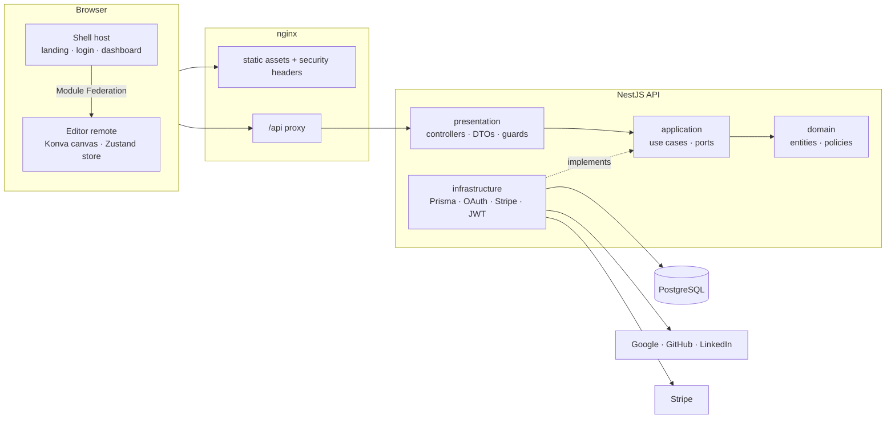

# Aledobe

A free, browser-based design tool — frames, auto layout, vector tools, text, effects, pages, export and a dev mode — with per-user workspaces, OAuth sign-in and optional Pro billing.

```
/frontend   npm workspaces · React 19 · Vite · Tailwind v4 · shadcn/ui · Module Federation
  apps/shell     host: 3D landing (three.js), login, dashboard, billing
  apps/editor    remote: the design editor (Konva, Zustand + Immer)
  packages/ui    shared shadcn/ui components and neon theme
/backend    NestJS · Prisma · PostgreSQL · DDD + SOLID
```

## Architecture



### Backend (DDD + SOLID)

Each bounded context lives in `backend/src/modules/<context>` with four layers:

| Layer | Contents | Depends on |
| --- | --- | --- |
| `domain` | Entities (`User`, `Project`, `DesignFile`), value rules, `PlanPolicy`, repository **ports** (abstract classes) | nothing |
| `application` | One use case per class (`CreateProjectUseCase`, `SignInWithOAuthUseCase`, …) and outbound ports (`SessionTokenService`, `PaymentGateway`, `AccountPlanReader`) | domain |
| `infrastructure` | Prisma repositories, JWT, Passport strategies, Stripe gateway | application / domain |
| `presentation` | Controllers, DTO validation, guards, decorators | application |

Contexts: **identity** (users, OAuth, sessions), **workspace** (projects, files, plan limits) and **billing** (Stripe). Contexts talk through ports — e.g. `workspace` reads a user's plan via `AccountPlanReader`, implemented by an adapter over the identity repository.

### Frontend

- `apps/editor/src/core` is the editor's pure domain (document model, geometry, auto layout, history, export) with no React; `components/` is the UI.
- `apps/shell/src/lib/api.ts` defines a `Backend` port with two adapters: the NestJS API and a local (browser storage) adapter used when the API is offline.
- The editor is a **Module Federation remote** loaded on demand by the shell, so it can be deployed and versioned independently.

## Getting started

Requirements: Node 22+, Docker.

### Everything with Docker

```bash
docker compose up --build
```

Open http://localhost:8080. In this local stack the developer login is enabled, so you can sign in without OAuth credentials.

### Local development

```bash
docker compose up -d postgres

cd backend
cp .env.example .env
npm install
npx prisma migrate dev
npm run start:dev

cd ../frontend
cp apps/shell/.env.example apps/shell/.env
npm install
npm run dev
```

- Shell: http://localhost:5173 · Editor (standalone): http://localhost:5174 · API: http://localhost:3000/api

### OAuth providers

Create OAuth apps and fill `backend/.env`. Callback URLs:

| Provider | Callback URL |
| --- | --- |
| Google | `{API_URL}/auth/google/callback` |
| GitHub | `{API_URL}/auth/github/callback` |
| LinkedIn (OpenID Connect) | `{API_URL}/auth/linkedin/callback` |

Providers without credentials are disabled automatically.

### Stripe

Set `STRIPE_SECRET_KEY`, `STRIPE_PRICE_PRO` and `STRIPE_WEBHOOK_SECRET`, and point a webhook to `{API_URL}/billing/webhook` with the events `checkout.session.completed`, `customer.subscription.created`, `customer.subscription.updated` and `customer.subscription.deleted`.

## Tests

| Command | What it runs |
| --- | --- |
| `cd backend && npm test` | domain and use-case unit tests (in-memory adapters) |
| `cd backend && npm run test:e2e` | API e2e tests against PostgreSQL, including the security suite |
| `cd frontend && npm test` | editor unit tests |
| `cd frontend && npm run test:e2e` | Playwright end-to-end tests against the running stack (`E2E_BASE_URL`, default `http://localhost:8080`) |

## CI/CD

- **CI** (`.github/workflows/ci.yml`): backend unit + e2e with a PostgreSQL service, frontend typecheck/unit/build, then the full stack via `docker compose` with Playwright e2e.
- **CD** (`.github/workflows/cd.yml`): builds and pushes `backend` and `frontend` images to GitHub Container Registry with SBOM and provenance.
- **CodeQL** and **Dependabot** keep code and dependencies under watch.

See [SECURITY.md](SECURITY.md) for the security model.
